# 🤖 DeFAI - Autonomous DeFi AI Agents

<div align="center">
  
[](https://github.com/CurioL-abs/defai-core/stargazers)
[](LICENSE)
[](https://discord.gg/YOUR_DISCORD)
[](https://twitter.com/defailabs)

**Revolutionary DeFi yield optimization platform powered by autonomous AI agents on Solana**

[🚀 Quick Start](#-quick-start) • [🏗️ Architecture](#️-architecture) • [📖 Documentation](#-documentation) • [🤝 Contributing](#-contributing)

</div>

---

## 🌟 **What is DeFAI?**

DeFAI is a cutting-edge platform that combines artificial intelligence with decentralized finance to create autonomous trading agents. These AI-powered agents work 24/7 to optimize your DeFi yields across multiple protocols on Solana.

### ✨ **Key Features**

- 🤖 **Autonomous AI Agents**: Create and manage AI-powered trading bots
- 📊 **Multi-Strategy Support**: Yield farming, arbitrage, and lending strategies
- 🔗 **Multi-Protocol Integration**: Jupiter, Raydium, Orca, Marginfi, and more
- 🛡️ **Risk Management**: Advanced stop-loss and profit-taking mechanisms
- 📈 **Real-time Analytics**: Comprehensive performance tracking and reporting
- 🌐 **Beautiful Dashboard**: Modern, responsive web interface
- ⚡ **High Performance**: Built on Solana for fast, low-cost transactions

---

## 🏗️ **Architecture Overview**

DeFAI follows a microservices architecture with separate repositories for each component:

```mermaid
graph TB
    Frontend[🖥️ defai-frontend<br/>React Dashboard] --> Backend[⚙️ defai-backend<br/>FastAPI Gateway]
    Frontend --> AgentEngine[🤖 defai-agent-engine<br/>Agent Management]

    Backend --> AIService[🧠 defai-ai-service<br/>ML Inference]
    AgentEngine --> AIService
    AgentEngine --> Contracts[📜 defai-contracts<br/>Smart Contracts]

    Contracts --> Solana[🟣 Solana Network<br/>DeFi Protocols]

    subgraph "Data Layer"
        Postgres[(🐘 PostgreSQL)]
        Redis[(⚡ Redis)]
    end

    Backend --> Postgres
    AgentEngine --> Postgres
    AgentEngine --> Redis

    subgraph "External APIs"
        Jupiter[Jupiter API]
        Pyth[Pyth Network]
        Birdeye[Birdeye API]
    end

    AgentEngine --> Jupiter
    AgentEngine --> Pyth
    AgentEngine --> Birdeye
```



---

## 📦 **Repository Structure**

| Repository                                                                     | Description                       | Tech Stack                    | Status     |
| ------------------------------------------------------------------------------ | --------------------------------- | ----------------------------- | ---------- |
| **[defai-core](https://github.com/CurioL-abs/defai-core)**                     | Main orchestration & Docker setup | Docker, Docs                  | ✅ Active  |
| **[defai-frontend](https://github.com/CurioL-abs/defai-frontend)**             | React dashboard interface         | Next.js, TypeScript, Tailwind | ✅ Active  |
| **[defai-agent-engine](https://github.com/CurioL-abs/defai-agent-engine)**     | AI agent management service       | FastAPI, SQLModel, AsyncIO    | ✅ Active  |
| **[defai-ai-service](https://github.com/CurioL-abs/defai-ai-service)**         | Machine learning inference        | Python, Scikit-learn, FastAPI | ✅ Active  |
| **[defai-backend](https://github.com/CurioL-abs/defai-backend)**               | API gateway service               | FastAPI, PostgreSQL           | ✅ Active  |
| **[defai-contracts](https://github.com/CurioL-abs/defai-contracts)**           | Smart contracts                   | Solidity, Anchor, Rust        | ✅ Active  |
| **[defai-shared](https://github.com/CurioL-abs/defai-shared)**                 | Shared libraries & types          | TypeScript, Python            | 🔄 Planned |
| **[defai-infrastructure](https://github.com/CurioL-abs/defai-infrastructure)** | Infrastructure as Code            | Terraform, K8s                | 🔄 Planned |

---

## 🚀 **Quick Start**

### **Option 1: Docker Compose (Recommended)**

```bash
# Clone the main orchestration repo
git clone https://github.com/CurioL-abs/defai-core.git
cd defai-core

# Clone all service repositories
./scripts/clone-all.sh

# Start all services
docker-compose up --build

# Access the dashboard
open http://localhost:3000
```

### **Option 2: Local Development**

```bash
# Clone all repositories
git clone https://github.com/CurioL-abs/defai-core.git
cd defai-core && ./scripts/setup-dev.sh

# Start individual services (separate terminals)
cd defai-frontend && npm run dev          # Port 3000
cd defai-backend && uvicorn app.main:app  # Port 8000
cd defai-agent-engine && uvicorn main:app # Port 8002
cd defai-ai-service && uvicorn main:app   # Port 8001
```

### **Prerequisites**

- 🐳 **Docker & Docker Compose** (recommended)
- 🟢 **Node.js 18+** (for frontend)
- 🐍 **Python 3.11+** (for backend services)
- 🦀 **Rust & Anchor** (for Solana contracts)
- 🗄️ **PostgreSQL 15+** (for data persistence)

---

## 🎯 **Getting Started**

1. **Create Your First Agent**: Use our intuitive wizard to configure an AI trading agent
2. **Choose Strategy**: Select from yield farming, arbitrage, or lending strategies
3. **Set Risk Parameters**: Configure investment limits, stop-losses, and profit targets
4. **Deploy & Monitor**: Watch your agent trade autonomously with real-time analytics

---

## 🌐 **Live Demo**

🚀 **[Try DeFAI Live Demo](https://demo.defai.finance)**

Experience DeFAI with testnet tokens and see how autonomous agents can optimize your DeFi yields.

---

## 📖 **Documentation**

- 📚 **[Developer Docs](https://docs.defai.finance)** - Comprehensive development guide
- 🤖 **[Agent Strategies](https://docs.defai.finance/strategies)** - Available trading strategies
- 🔧 **[API Reference](https://docs.defai.finance/api)** - Complete API documentation
- 🏦 **[DeFi Protocols](https://docs.defai.finance/protocols)** - Supported protocols guide
- 🎯 **[Tutorials](https://docs.defai.finance/tutorials)** - Step-by-step tutorials

---

## 🛠️ **Development**

### **Contributing to Services**

Each service has its own repository with specific contribution guidelines:

- **Frontend**: UI/UX improvements, React components → [defai-frontend](https://github.com/CurioL-abs/defai-frontend)
- **Backend**: API endpoints, authentication → [defai-backend](https://github.com/CurioL-abs/defai-backend)
- **Agent Engine**: AI strategies, blockchain integration → [defai-agent-engine](https://github.com/CurioL-abs/defai-agent-engine)
- **AI Service**: ML models, prediction algorithms → [defai-ai-service](https://github.com/CurioL-abs/defai-ai-service)
- **Smart Contracts**: Solana programs, DeFi integrations → [defai-contracts](https://github.com/CurioL-abs/defai-contracts)

### **Development Workflow**

1. Fork the specific service repository
2. Create a feature branch: `git checkout -b feature/amazing-feature`
3. Make your changes with tests
4. Submit a pull request to the respective repo
5. Integration testing in this core repository

---

## 🗺️ **Roadmap**

### **Q1 2025 - Foundation** ✅

- [x] Core architecture and microservices
- [x] Basic AI agent framework
- [x] Solana smart contracts
- [x] Web dashboard (MVP)

### **Q2 2025 - Enhancement** 🔄

- [ ] Advanced ML strategies
- [ ] Multi-chain support (Ethereum)
- [ ] Mobile application
- [ ] Advanced analytics dashboard

### **Q3 2025 - Scale** 🔮

- [ ] Institutional features
- [ ] API marketplace
- [ ] Community governance
- [ ] Advanced risk management

### **Q4 2025 - Expansion** 🔮

- [ ] Cross-chain arbitrage
- [ ] AI strategy marketplace
- [ ] Automated portfolio rebalancing
- [ ] Enterprise solutions

---

## 🤝 **Contributing**

We welcome contributions from the community! Here's how you can help:

### **Ways to Contribute**

- 🐛 **Bug Reports**: Found a bug? Open an issue in the relevant repository
- 💡 **Feature Requests**: Have an idea? Share it in our discussions
- 🔧 **Code Contributions**: Submit PRs for fixes and improvements
- 📖 **Documentation**: Help improve our docs and tutorials
- 🎨 **Design**: UI/UX improvements and feedback
- 🧪 **Testing**: Help test new features and report issues

### **Community Guidelines**

- Be respectful and constructive
- Follow each repository's contribution guidelines
- Test your changes thoroughly
- Write clear commit messages
- Document your changes

---

## 🏆 **Community & Support**

- 💬 **[Discord](https://discord.gg/defai)** - Join our developer community
- 🐦 **[Twitter](https://twitter.com/defailabs)** - Follow for updates
- 📧 **[Email](mailto:hello@defai.finance)** - Direct support
- 📝 **[Blog](https://blog.defai.finance)** - Latest news and tutorials
- 🎥 **[YouTube](https://youtube.com/@defailabs)** - Video tutorials

---

## ⚖️ **Legal & Security**

- **License**: MIT License - see [LICENSE](LICENSE) file
- **Security**: Report vulnerabilities to security@defai.finance
- **Privacy**: Read our [Privacy Policy](https://defai.finance/privacy)
- **Terms**: See our [Terms of Service](https://defai.finance/terms)

---

## 🙏 **Acknowledgments**

Built with ❤️ by the DeFAI team and powered by:

- 🟣 **Solana** - High-performance blockchain
- ⚡ **Jupiter** - DEX aggregation
- 🔮 **Pyth Network** - Real-time price feeds
- 🧠 **Scikit-learn** - Machine learning models
- ⚛️ **React & Next.js** - Frontend framework
- 🚀 **FastAPI** - Backend services

---

<div align="center">

**[🌟 Star us on GitHub](https://github.com/CurioL-abs/defai-core) • [🐦 Follow on Twitter](https://twitter.com/defailabs) • [💬 Join Discord](https://discord.gg/defai)**

_Revolutionizing DeFi with Autonomous AI Agents_

</div>

# DeFAI Forecast Optimizer
